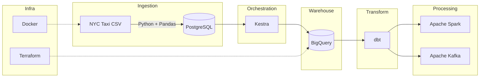

# Data Engineering Zoomcamp 2026

<p align="center">
  
  
</p>

My end-to-end implementation of the [Data Engineering Zoomcamp](https://github.com/DataTalksClub/data-engineering-zoomcamp) by [DataTalks.Club](https://datatalks.club/) — a free, hands-on course covering the full data engineering lifecycle from containerization to streaming.

---

## Architecture



## Tech Stack

| Layer | Technology |
|---|---|
| **Cloud** | Google Cloud Platform (GCP) |
| **Infrastructure as Code** | Terraform |
| **Containerization** | Docker, Docker Compose |
| **Orchestration** | Kestra |
| **Data Warehouse** | BigQuery |
| **Transformation** | dbt (data build tool) |
| **Batch Processing** | Apache Spark (PySpark) |
| **Streaming** | Apache Kafka |
| **Language** | Python 3.13, SQL |
| **Package Manager** | uv |

## Modules

| # | Module | Topics | Status |
|---|--------|--------|--------|
| 1 | [**Docker & Terraform**](my-work/01-docker-terraform/) | Containerization, PostgreSQL, IaC, data ingestion pipeline | :white_check_mark: Complete |
| 2 | [**Workflow Orchestration**](my-work/02-workflow-orchestration/) | Kestra, DAGs, scheduling | :construction: Up Next |
| 3 | [**Data Warehouse**](my-work/03-data-warehouse/) | BigQuery, partitioning, clustering | :hourglass: Planned |
| 4 | [**Analytics Engineering**](my-work/04-analytics-engineering/) | dbt, data modeling, testing | :hourglass: Planned |
| 5 | [**Data Platforms**](my-work/05-data-platforms/) | End-to-end pipelines with Bruin | :hourglass: Planned |
| 6 | [**Batch Processing**](my-work/06-batch/) | Apache Spark, DataFrames, distributed computing | :hourglass: Planned |
| 7 | [**Streaming**](my-work/07-streaming/) | Apache Kafka, Kafka Streams, Avro | :hourglass: Planned |
| | [**Final Project**](my-work/) | Capstone applying all concepts | :hourglass: Planned |

## Highlighted Work

### Module 1 — NYC Taxi Data Ingestion Pipeline

Built a containerized Python pipeline that downloads, parses, and loads NYC Yellow Taxi trip data into PostgreSQL:

- **CLI-driven** ingestion script with configurable connection params, date range, and chunk size ([`ingest_data.py`](my-work/01-docker-terraform/pipeline/ingest_data.py))
- **Typed schema** with explicit dtypes for all 16 columns and datetime parsing
- **Chunked loading** via Pandas iterator for memory-efficient processing of large CSV files
- **Dockerized** with a modern `uv`-based Python 3.13-slim image ([`Dockerfile`](my-work/01-docker-terraform/pipeline/Dockerfile))

```bash
# Example: ingest January 2021 data into local Postgres
uv run python ingest_data.py \
  --pg-user=root --pg-pass=root \
  --pg-host=localhost --pg-port=5432 \
  --pg-db=ny_taxi --target-table=yellow_taxi_trips
```

## Repository Structure

```
my-work/                        # All personal code lives here
├── 01-docker-terraform/
│   └── pipeline/
│       ├── ingest_data.py      # Data ingestion CLI
│       ├── Dockerfile          # Container definition
│       ├── pyproject.toml      # Dependencies (uv)
│       └── notebook.ipynb      # Exploratory analysis
├── 02-workflow-orchestration/
├── 03-data-warehouse/
├── 04-analytics-engineering/
├── 05-data-platforms/
├── 06-batch/
├── 07-streaming/
└── homework/
```

> The root-level module folders (`01-docker-terraform/`, `02-workflow-orchestration/`, etc.) are the upstream course materials — kept locally for reference but excluded from git via `.gitignore`.

## Lessons Learned

- **Docker networking** — Connecting a Python container to a Postgres container requires the Docker internal network hostname, not `localhost`.
- **GCP IAM** — Resolved 403 errors on GCS by assigning the `Storage Admin` role to the service account — a common gotcha with Terraform + GCP.
- **Chunked ingestion** — Loading millions of taxi records at once causes OOM errors; iterating with `chunksize` in `pd.read_csv` keeps memory bounded.

## Getting Started

```bash
# Clone the repo
git clone https://github.com/Rpvermaak/data-engineering-zoomcamp.git
cd data-engineering-zoomcamp/my-work/01-docker-terraform/pipeline

# Install dependencies (requires uv — https://docs.astral.sh/uv/)
uv sync

# Start Postgres (from docker-compose in the course materials)
docker compose up -d

# Run the ingestion pipeline
uv run python ingest_data.py --pg-db=ny_taxi --target-table=yellow_taxi_trips
```

## Acknowledgments

This project follows the curriculum of the [Data Engineering Zoomcamp](https://github.com/DataTalksClub/data-engineering-zoomcamp) by [DataTalks.Club](https://datatalks.club/), taught by [Alexey Grigorev](https://linkedin.com/in/agrigorev) and team.
