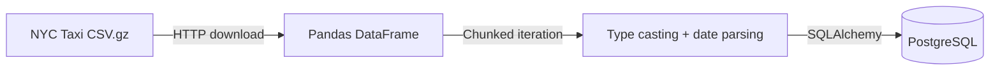

# NYC Taxi Data Ingestion Pipeline

A CLI tool that downloads NYC Yellow Taxi trip records and loads them into a PostgreSQL database. Built as part of Module 1 (Docker & Terraform) of the Data Engineering Zoomcamp.

## How It Works



1. Downloads compressed CSV from the [NYC TLC dataset](https://github.com/DataTalksClub/nyc-tlc-data/releases)
2. Reads in chunks (default 100k rows) to stay memory-efficient
3. Casts all 16 columns to explicit dtypes (`Int64`, `float64`, `string`)
4. Parses pickup/dropoff timestamps
5. Creates the target table on first chunk, then appends

## Usage

```bash
# Install dependencies
uv sync

# Run with defaults (localhost Postgres, Jan 2021)
uv run python ingest_data.py \
  --pg-user=root \
  --pg-pass=root \
  --pg-host=localhost \
  --pg-port=5432 \
  --pg-db=ny_taxi \
  --target-table=yellow_taxi_trips

# Custom date range
uv run python ingest_data.py --year=2022 --month=6 --target-table=yellow_taxi_trips
```

### CLI Options

| Flag | Default | Description |
|------|---------|-------------|
| `--pg-user` | `root` | PostgreSQL user |
| `--pg-pass` | `root` | PostgreSQL password |
| `--pg-host` | `localhost` | PostgreSQL host |
| `--pg-port` | `5432` | PostgreSQL port |
| `--pg-db` | `ny_taxi` | Database name |
| `--year` | `2021` | Data year |
| `--month` | `1` | Data month |
| `--target-table` | `yellow_taxi_data` | Target table name |
| `--chunksize` | `100000` | Rows per chunk |

## Docker

```bash
docker build -t taxi-ingest .
docker run --network=host taxi-ingest
```

## Files

| File | Purpose |
|------|---------|
| `ingest_data.py` | Main ingestion script |
| `pipeline.py` | Simple pipeline prototype (exports to Parquet) |
| `Dockerfile` | Container image using `uv` + Python 3.13-slim |
| `pyproject.toml` | Project config and dependencies |
| `notebook.ipynb` | Exploratory data analysis |

## Dependencies

- **pandas** — DataFrame operations and CSV reading
- **sqlalchemy** — Database abstraction layer
- **psycopg** — PostgreSQL driver (binary + connection pooling)
- **click** — CLI argument parsing
- **tqdm** — Progress bars for chunk iteration
- **pyarrow** — Parquet serialization